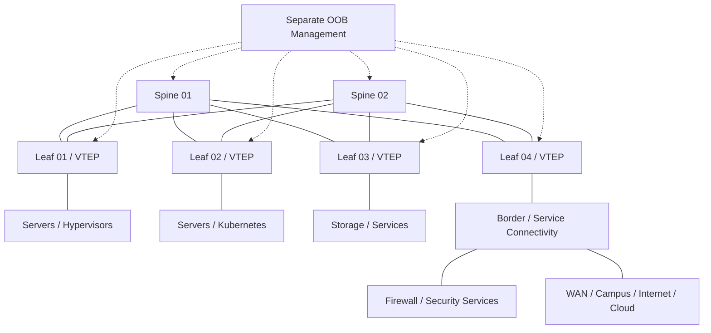

# Data Center EVPN-VXLAN Reference Architecture

[](#)
[](#)
[](#)

A vendor-neutral reference design for a modern **leaf-spine data-center fabric using BGP EVPN as the control plane and VXLAN as the overlay encapsulation**.

The project focuses on architecture decisions, addressing, failure domains, route types, tenant segmentation, operational validation and a reusable data model rather than presenting vendor-specific CLI as if it were universally portable.

> **Important:** This is a reference architecture/lab. Hardware scale, feature support, timers, route-target behavior, multihoming implementation and syntax must be validated against the selected network operating system and software release.

## Why EVPN-VXLAN

Traditional large Layer-2 domains can create operational and scaling constraints. EVPN-VXLAN allows the physical underlay to remain a routed IP fabric while virtual network segments are extended through an overlay.

Key architecture properties:

- Layer-3 leaf-spine underlay with ECMP;
- predictable east-west topology;
- VXLAN VNIs for tenant/segment separation;
- BGP EVPN for endpoint and reachability distribution;
- support for distributed anycast gateway patterns;
- reduced dependence on spanning tree inside the fabric;
- scalable addition of leaf/compute racks when capacity grows.

## Reference topology



## Architecture layers

### Underlay

The underlay provides IP reachability between loopbacks/VTEPs. The reference design assumes:

- point-to-point routed leaf-spine links;
- ECMP across both spines;
- dedicated loopbacks for routing identity/VTEP use;
- an IGP or eBGP underlay depending on design preference;
- consistent MTU large enough for VXLAN overhead;
- no tenant VLAN stretched through the physical underlay.

### Overlay

The overlay uses MP-BGP EVPN to distribute reachability. Concepts demonstrated in this repository include:

- Layer-2 VNI mapping;
- Layer-3 VNI / tenant VRF mapping;
- route distinguishers and route targets;
- distributed anycast gateway;
- EVPN MAC/IP advertisement concepts;
- IP-prefix advertisement for routed tenant connectivity.

## Example addressing plan

| Function | Example |
|---|---|
| Spine loopbacks | `10.255.0.1/32` – `10.255.0.2/32` |
| Leaf loopbacks | `10.255.1.1/32` onward |
| P2P fabric links | `10.0.0.0/31`, sequential /31s |
| Tenant A VLAN/VNI | VLAN 110 / VNI 10110 |
| Tenant B VLAN/VNI | VLAN 120 / VNI 10120 |
| Tenant A L3 VNI | VNI 50001 |
| Tenant B L3 VNI | VNI 50002 |

All values are lab examples and should be allocated from a controlled IP/VLAN/VNI plan.

## Repository structure

```text
.
├── README.md
├── diagrams/fabric.mmd
├── docs/
│   ├── design-principles.md
│   ├── evpn-control-plane.md
│   └── validation-plan.md
└── models/
    └── fabric-intent.yaml
```

## Key design decisions

| Decision | Reference position |
|---|---|
| Fabric topology | Two or more spines with every leaf connected to each spine |
| Underlay | Routed point-to-point links with ECMP |
| Overlay | MP-BGP EVPN |
| Encapsulation | VXLAN |
| Default gateway | Distributed anycast gateway where supported/appropriate |
| Tenant isolation | VRF + L3 VNI; segments mapped to L2 VNIs |
| External connectivity | Dedicated border/service leaf role when scale or policy warrants |
| Management | Physically/logically separate OOB path for device recovery |

## Operational validation

A useful fabric lab should prove more than reachability. Validate:

1. underlay adjacency and ECMP paths;
2. VTEP loopback reachability;
3. BGP EVPN neighbor state;
4. expected MAC/IP route learning;
5. VNI membership;
6. same-subnet east-west connectivity;
7. inter-subnet routing through the intended VRF;
8. north-south route advertisement/filtering;
9. single spine/link failure convergence;
10. leaf or multihoming failure behavior where applicable;
11. MTU end to end;
12. telemetry and troubleshooting visibility.

## Related portfolio projects

- [OpenStack Private Cloud Reference Architecture](https://github.com/DeeSanas/openstack-private-cloud-reference-architecture)
- [Hybrid Cloud Reference Architecture](https://github.com/DeeSanas/hybrid-cloud-reference-architecture)
- [Terraform Enterprise Module Library](https://github.com/DeeSanas/terraform-enterprise-module-library)

## Roadmap

- [x] Vendor-neutral logical architecture
- [x] EVPN control-plane reference
- [x] Fabric intent data model
- [x] Failure/validation plan
- [ ] Add container-based interoperability lab
- [ ] Add multihoming/ESI design example
- [ ] Add telemetry dashboard example
