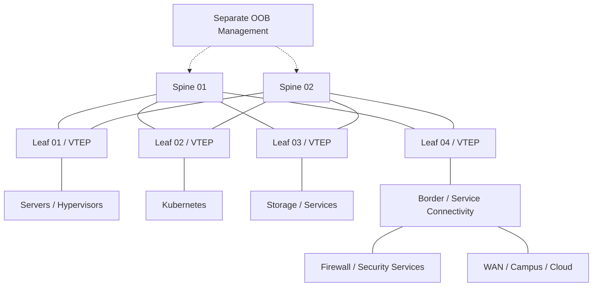

# Data Center EVPN-VXLAN Reference Architecture

[](#)
[](#)
[](#)

A vendor-neutral reference design for a modern **leaf-spine data-center fabric using BGP EVPN as the control plane and VXLAN as the overlay encapsulation**, extended with observability and enterprise backup/DR reference projects.

> **Important:** These are reference architectures/labs. Hardware scale, feature support, timers, route-target behavior, multihoming, backup products, retention and recovery targets must be validated for the selected environment.

## Why EVPN-VXLAN

EVPN-VXLAN allows the physical underlay to remain a routed IP fabric while tenant segments are delivered through an overlay.

Key architecture properties:

- Layer-3 leaf-spine underlay with ECMP;
- predictable east-west topology;
- VXLAN VNIs for segment separation;
- BGP EVPN for endpoint/reachability distribution;
- distributed anycast gateway patterns;
- reduced dependence on spanning tree;
- scalable addition of leaf/compute racks.

## Reference topology



## Architecture layers

### Underlay

- routed point-to-point leaf-spine links;
- ECMP across spines;
- dedicated loopbacks for routing/VTEPs;
- IGP or eBGP underlay depending on design;
- MTU sized for VXLAN overhead;
- no tenant VLAN stretched through the physical underlay.

### Overlay

- MP-BGP EVPN;
- L2 VNI mapping;
- L3 VNI / tenant VRF mapping;
- route distinguishers and route targets;
- distributed anycast gateway;
- MAC/IP and prefix reachability distribution.

## Example addressing

| Function | Example |
|---|---|
| Spine loopbacks | `10.255.0.1/32` – `10.255.0.2/32` |
| Leaf loopbacks | `10.255.1.1/32` onward |
| P2P fabric links | sequential `/31` networks |
| Tenant A | VLAN 110 / VNI 10110 |
| Tenant B | VLAN 120 / VNI 10120 |
| Tenant A L3 VNI | VNI 50001 |
| Tenant B L3 VNI | VNI 50002 |

## Portfolio projects in this repository

### [Enterprise Observability Platform](projects/enterprise-observability-platform)
Metrics, logs, traces, events, telemetry pipelines, alerting, SLI/SLO and error-budget modeling with machine-readable SLO data and deterministic validation.

### [Enterprise Backup & Disaster Recovery](projects/enterprise-backup-dr)
Policy-driven backup architecture covering VM, database, Kubernetes and cloud workloads; primary/secondary repositories, immutable copies, isolated recovery, restore testing and machine-validated backup policy.

## Repository structure

```text
.
├── README.md
├── diagrams/fabric.mmd
├── docs/
├── models/fabric-intent.yaml
├── scripts/validate_fabric_intent.py
├── projects/
│   ├── enterprise-observability-platform/
│   └── enterprise-backup-dr/
└── .github/workflows/
```

## Key design decisions

| Decision | Reference position |
|---|---|
| Fabric topology | Two or more spines with every leaf connected to each spine |
| Underlay | Routed point-to-point links with ECMP |
| Overlay | MP-BGP EVPN |
| Encapsulation | VXLAN |
| Default gateway | Distributed anycast gateway where supported/appropriate |
| Tenant isolation | VRF + L3 VNI; segments mapped to L2 VNIs |
| External connectivity | Border/service leaf role when scale or policy warrants |
| Management | Separate OOB path for device recovery |
| Observability | Common telemetry pipeline with service context and actionable alerts |
| Backup/DR | Independent copies, immutability for critical data and tested restore procedures |

## Operational validation

Validate more than reachability:

1. underlay adjacency and ECMP;
2. VTEP loopback reachability;
3. BGP EVPN neighbor state;
4. expected MAC/IP route learning;
5. VNI/VRF membership;
6. east-west and north-south policy;
7. link/spine failure convergence;
8. MTU end to end;
9. telemetry/alert visibility;
10. backup job success plus actual restore tests;
11. immutable/secondary recovery-copy health;
12. documented recovery ownership.

## Related portfolio projects

- [OpenStack Private Cloud Reference Architecture](https://github.com/DeeSanas/openstack-private-cloud-reference-architecture)
- [Hybrid Cloud Reference Architecture](https://github.com/DeeSanas/hybrid-cloud-reference-architecture)
- [Infrastructure Automation Library](https://github.com/DeeSanas/terraform-enterprise-module-library)

## Roadmap

- [x] Vendor-neutral EVPN-VXLAN architecture
- [x] EVPN control-plane reference
- [x] Fabric intent data model and CI validation
- [x] Enterprise observability/SRE project
- [x] Enterprise backup/DR project
- [ ] Add container-based interoperability lab
- [ ] Add multihoming/ESI example
- [ ] Add telemetry dashboard implementation example
