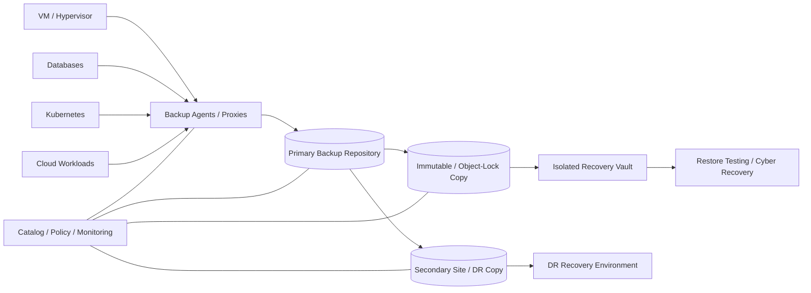

# Enterprise Backup & Disaster Recovery Reference Architecture

A vendor-neutral reference architecture for protecting enterprise workloads across **virtualization, databases, Kubernetes, cloud and data-center platforms** using policy-driven backup, immutable copies, isolated recovery and tested restoration.

> This project is a reference implementation. Retention, media, encryption, replication, immutability, legal hold, RTO/RPO, application consistency and product-specific integration must be validated for the real environment.

## Objectives

- align backup policy to business criticality rather than one retention rule for all workloads;
- keep production backup, secondary copy and isolated/immutable recovery paths separated;
- design restore testing as an operational control;
- include applications, databases, VM platforms and cloud-native workloads;
- make recovery ownership and evidence measurable.

## Logical architecture



Editable source: [`diagrams/backup-dr.mmd`](diagrams/backup-dr.mmd).

## Reference protection tiers

| Tier | Example | Backup frequency | Retention | Additional control |
|---|---|---|---|---|
| Critical | databases / core services | hourly or application-aware | 30–90 days plus long-term policy | immutable copy + DR replication |
| High | important business applications | 4–12 hourly | 30–60 days | secondary copy |
| Standard | general VM/app workloads | daily | 30 days | weekly independent copy |
| Archive | compliance/history | policy-defined | months/years | WORM/object lock where required |

Values are examples; actual policy must come from business, legal and regulatory requirements.

## Design principles

1. **Backup is not DR.** A backup copy is a recovery input; DR also requires infrastructure, networking, identity, runbooks and application orchestration.
2. **Replication is not backup.** Logical corruption or malicious deletion may replicate immediately.
3. **Immutability is time-bound.** Define retention lock and administrative separation deliberately.
4. **Restore tests are mandatory.** A successful backup job does not prove recoverability.
5. **Application consistency matters.** Databases and transactional systems require supported consistency mechanisms.
6. **Recovery credentials must survive the incident.** Protect catalog, encryption keys, identity and break-glass access.

## Included artifacts

- architecture diagram;
- machine-readable backup policy model;
- Python policy validator;
- CI workflow validating the reference model.

## Run validation

```bash
python scripts/check_backup_policy.py models/backup-policy.json
```

The validator checks required fields, backup frequency/retention values and presence of an immutable control for critical workloads.

## Operational evidence to retain

- backup job success/failure history;
- restore test evidence;
- recovery time measured against RTO;
- recovered-point timestamp measured against RPO;
- immutable-copy health;
- catalog/configuration backups;
- encryption-key recovery procedure;
- documented exceptions and business sign-off.
